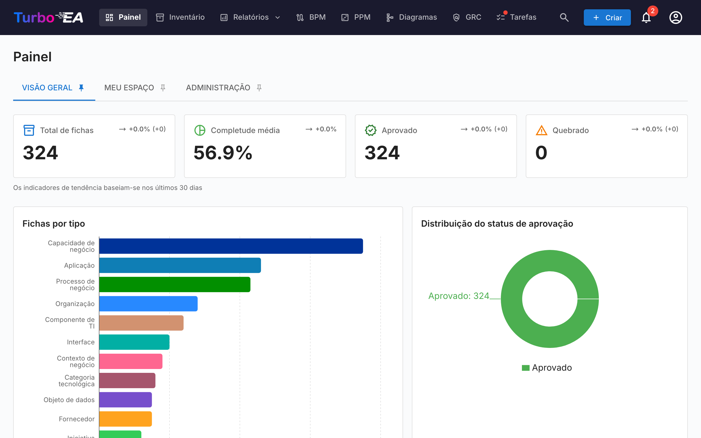
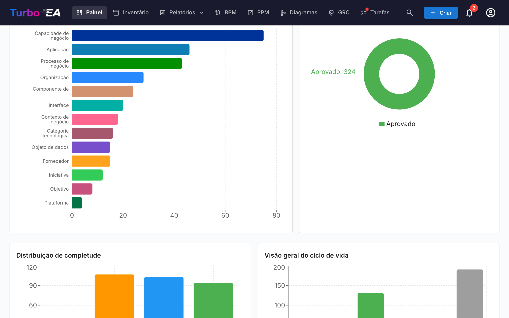

# Painel Principal

O Painel Principal é a primeira tela que você vê após fazer login. Ele fornece uma **visão geral rápida** de todo o status da arquitetura empresarial.

## Barra de Navegação Superior

Na parte superior da tela, você encontrará a **barra de navegação principal** com os seguintes elementos:

- **Turbo EA** (logo): Clique para retornar ao Painel Principal de qualquer seção
- **Painel**: Visão geral do status da arquitetura
- **Inventário**: Listagem completa de todos os cards
- **Relatórios**: Relatórios visuais e analíticos
- **BPM**: Business Process Management (se habilitado)
- **Diagramas**: Editor visual de diagramas de arquitetura
- **Entrega EA**: Gestão de iniciativas de arquitetura
- **Tarefas**: Tarefas pendentes e pesquisas atribuídas
- **Pesquisar cards**: Barra de busca rápida com autocompletar
- **+ Criar**: Botão para criar rapidamente novos cards
- **Sino de notificações**: Alertas do sistema e [notificações](notifications.md)
- **Ícone de perfil**: Seleção de idioma, alternância de tema, preferências de notificação e acesso à administração

## Cards de Resumo

A seção principal do Painel exibe **cards de resumo** indicando:

- **Número total de cards**: Contagem de todos os componentes registrados na plataforma
- **Distribuição por tipo**: Quantos elementos de cada tipo existem (Aplicações, Organizações, Objetivos, Capacidades, etc.)
- **Visão geral de status**: Visualizações rápidas do status geral

Clicar em um card de tipo navega para o [Inventário](inventory.md) pré-filtrado para esse tipo.

## Gráficos e Estatísticas

Na seção inferior do Painel, você encontrará:

- **Gráfico de distribuição por tipo**: Mostra a proporção de cada tipo de card no seu cenário
- **Status de aprovação**: Indica quantos cards estão aprovados, pendentes, quebrados ou rejeitados
- **Qualidade dos dados**: Porcentagem geral de completude das informações em todos os cards
- **Atividade recente**: Um feed das últimas alterações — quem editou o quê e quando

## Aba «Espaço de trabalho»

A aba **Espaço de trabalho** reúne tudo o que está atribuído a você: favoritos, tarefas, pesquisas pendentes, atividade recente em seus cards e a seção **Cards com meu papel**.

Esta última agrupa os cards pelo papel de parte interessada que você desempenha (Application Owner, Business Owner, etc.) e lista os cards sob cada papel. Se seu papel concede a permissão `stakeholders.view` (admin, member e viewer por padrão), um pequeno ícone **person_search** aparece ao lado do título da seção: selecione um usuário na autocompletação e a seção é recarregada com os papéis e cards dele. O título muda para «Funções desempenhadas por {name}». Clique no pequeno ícone de fechar para voltar aos seus próprios papéis. Útil para responder a «o que essa pessoa possui?» com um clique.
